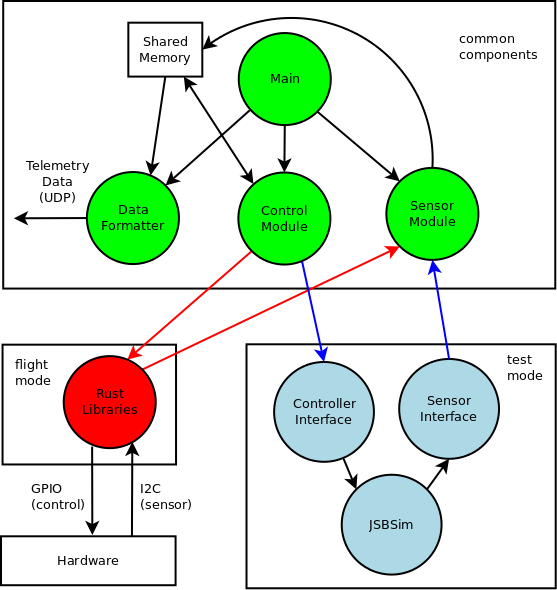

# Reaction Control System (RCS) Software Architecture

## Overview

The Reaction Control System (RCS) software can be compiled for two distinct
target modes -- flight mode and test mode. Common components to both flight and 
test modes include Main, Control, Sensor, and Data Formatter modules.

In flight mode, sensor data is retrieved from the hardware over an I2C bus
using Rust libraries. The control algorithm uses sensor data to
compute any required changes in trajectory and again uses Rust
libraries to assert signals on the hardware GPIO pins to control the rocket
nozzles.

In test mode, the Rust libraries are replaced by a controller/sensor
interface that matches the library interface used in flight mode.
The hardware is replaced by JSBSim to model sensor responses to control inputs.

## Software Components

### _Common Components_
#### Main
The main module is executed at program startup and does the following:

* Initializes the shared memory interface
* Passes the location of shared memory to the sensor module initialization
* Passes the location of shared memory to the control module initialization
* Sets up a mechanism to execute the main loop at a periodic rate
* Drops into the main loop where:
    * Sensor updates are requested from the sensor module
    * Control updates are requested from the control module

#### Control Module
The control module implements the control algorithm. Sensor data is retrieved from shared memory and GPIO pins are asserted for course correction. The control module provides :

* An initialization function that receives the location of shared memory and sets up the control hardware
* An update function that uses sensor data contained in shared memory 
to calculate course updates

#### Sensor Module
The sensor module retrieves sensor data and stores it in shared memory.  The sensor module provides:

* An initialization function that receives the location of shared memory and sets up the sensor hardware
* An update function that reads sensor data from hardware and stores it in shared memory

#### Data Formatter
The data formatter gets telemetry data from the control module, transforms it to [psas-packet format](http://psas-packet-serializer.readthedocs.org/), and writes it out to a file.

### _Flight Mode Components_
#### Std Rust Libraries
During flight mode, the system reads sensor input and dispatches control signals via [I2C](https://github.com/rust-embedded/rust-i2cdev) and [GPIO](https://github.com/rust-embedded/rust-sysfs-gpio) Rust libraries.

### _Test Mode Components_
#### Controller Interface
The controller interface provides a set of functions that are equivalent to
the function calls made by the control module in flight mode. Hardware
compatible compatible data received from the control module is converted to
a compatible format and sent on to JSBSim.

#### Sensor Interface
The sensor interface provides a set of functions that are equivalent to the
function calls made by the sensor module in flight mode. JSBSim sensor data
is retrieved, converted into a hardware compatible format, and made available
to the sensor module.

#### JSBSim
JSBSim is commercial off the shelf (COTS) software that is used to
simulate sensor outputs based on control inputs.

